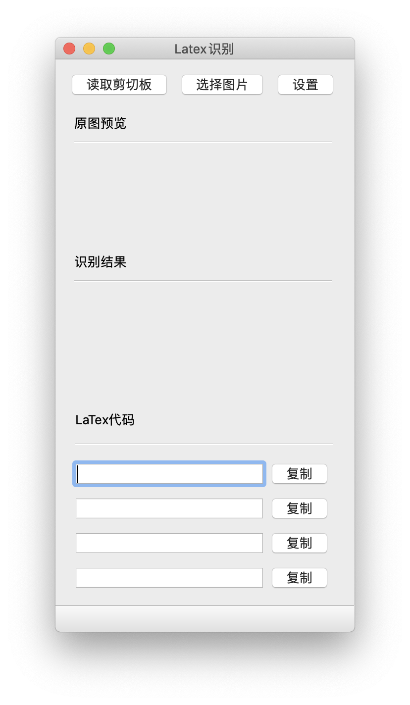
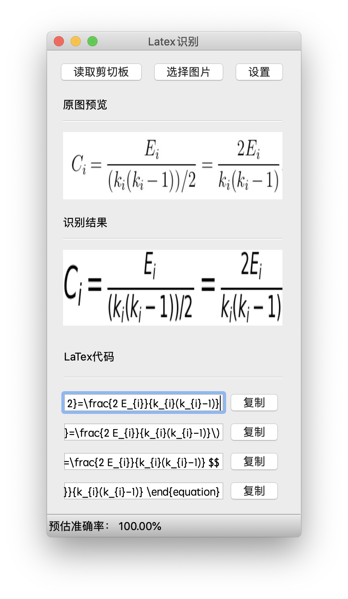

## 图片转LaTeX公式小工具简介

1. 简介

   本项目是用pyqt5开发的图片转latex公式小工具，调用了Mathpix的Api

2. 运行效果
   
   

3. 运行条件

   - python 3
   - pyqt5
   - matplotlib
   - requests
   - pyyaml
   - 你自己的app-id 和 app-key（详见[申请地址](https://mathpix.com/ocr)，每月1000次免费)

4. 运行

   安装好需要的第三方库后可直接运行app.py

5. 其他说明

